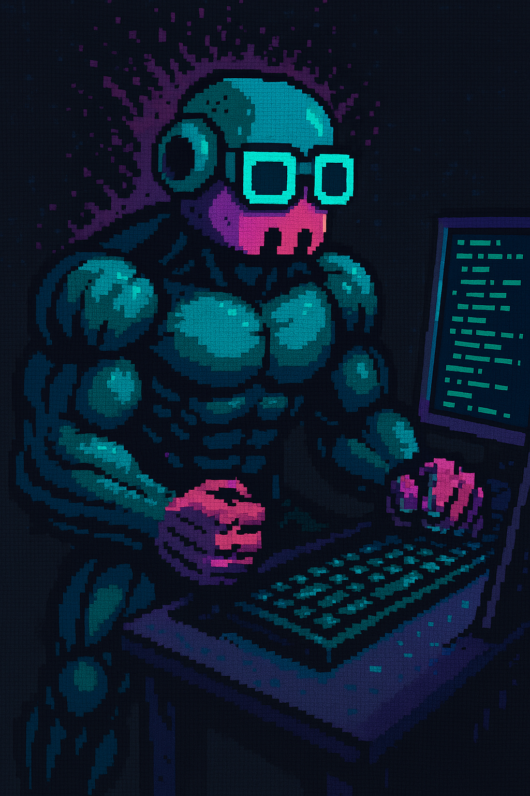

```
     ██████╗ ██╗  ██╗     ███╗   ███╗██╗   ██╗
    ██╔═══██╗██║  ██║     ████╗ ████║╚██╗ ██╔╝
    ██║   ██║███████║     ██╔████╔██║ ╚████╔╝
    ██║   ██║██╔══██║     ██║╚██╔╝██║  ╚██╔╝
    ╚██████╔╝██║  ██║     ██║ ╚═╝ ██║   ██║
     ╚═════╝ ╚═╝  ╚═╝     ╚═╝     ╚═╝   ╚═╝
               ██████╗ ██████╗ ██████╗ ██╗██╗      ██████╗ ████████╗
              ██╔════╝██╔═══██╗██╔══██╗██║██║     ██╔═══██╗╚══██╔══╝
              ██║     ██║   ██║██████╔╝██║██║     ██║   ██║   ██║
              ██║     ██║   ██║██╔═══╝ ██║██║     ██║   ██║   ██║
              ╚██████╗╚██████╔╝██║     ██║███████╗╚██████╔╝   ██║
               ╚═════╝ ╚═════╝ ╚═╝     ╚═╝╚══════╝ ╚═════╝    ╚═╝
       Turbocharge your Copilot CLI with multi-agent orchestration
```
<p align="left"  style="padding-left: 100px">
  
  </br>
  <strong><i>Your Copilot has been working out, learning new ways to improve your life.</i></strong>
</p>

---

[](https://www.npmjs.com/package/oh-my-copilot)
[](https://www.npmjs.com/package/oh-my-copilot)
[](https://github.com/RobinNorberg/oh-my-copilot/stargazers)
[](https://opensource.org/licenses/MIT)
<br/>This work is based on [oh-my-claudecode](https://github.com/yeachan-heo/oh-my-claudecode) by Yeachan Heo, but with copilot cli focus.

## Quick Start

```bash
# Step 1: Install
/plugin marketplace add https://github.com/RobinNorberg/oh-my-copilot
/plugin install oh-my-copilot@omcp
# or
npm i -g oh-my-copilot@latest

# Step 2: Setup
/omc-setup

# Step 3: Build something
/autopilot: build a todo-app
# or
autopilot: build a todo-app

# If you enjoy the output, give the repo att ⭐ and tell a friend 
```

### Not Sure Where to Start?

If you're uncertain about requirements, have a vague idea, or want to micromanage the design:

```
/deep-interview "I want to build a todo-app"
```

The deep interview uses Socratic questioning to clarify your thinking before any code is written.

---

## Key Features

- **Copilot CLI friendly** — Perfect for development in the terminal
- **Natural language interface** — no commands to memorize, just describe what you want
- **Team-first orchestration** — staged pipeline with plan, exec, verify, and fix loop
- **Automatic parallelization** — complex tasks distributed across our specialized agents
- **Smart model routing** — Haiku for simple tasks, Sonnet for average and Opus for complex reasoning
- **Persistent execution** — won't give up until the job is verified complete
- **Azure DevOps/GitHub native** — auto-detection, work item management, PR operations, triage workflows
- **Stop your yolo abuse** — using a layered permission model to help your agents perform safe work without your interference

---

## Magic Keywords

Optional shortcuts for power users. Natural language works fine without them.

| Keyword | Category | Effect | Example |
| ------- | -------- | ------ | ------- |
| `team` |  | Canonical Team orchestration | `team 3:executor "fix all TypeScript errors"` |
| `ask copilot` |  | Delegate to Copilot CLI | `ask claude "review auth architecture"` |
| `ask claude` |  | Delegate to Claude Code CLI | `ask claude "review auth architecture"` |
| `ask codex` |  | Delegate to Codex CLI | `ask codex "security analysis"` |
| `ask gemini` |  | Delegate to Gemini CLI | `ask gemini "suggest UX improvements"` |
| `c3g` |  | Quadri-model orchestration | `c3g review this PR` |
| `omcp team` |  | tmux CLI workers (codex/gemini/copilot) | `omcp team 2:codex "security review"` |
| `code review` |  | Code review mode | `code review the auth module` |
| `critique` |  | Pre-push adversarial critique | `critique my changes` |
| `debug`, `diagnose` |  | Session/repo diagnostics | `debug why hooks aren't firing` |
| `deep-analyze` |  | Deep analysis mode | `deep-analyze why tests are failing` |
| `deep-dive` |  | Trace → interview pipeline | `deep-dive why auth is slow` |
| `deepinit` |  | Deep codebase init with AGENTS.md | `deepinit` |
| `deep-interview` |  | Socratic requirements clarification | `deep-interview "vague idea"` |
| `deep-review` |  | Multi-pass code review (4 passes) | `deep-review this PR` |
| `deepsearch` |  | Codebase-focused search routing | `deepsearch for auth middleware` |
| `deslop`, `anti-slop` |  | AI code slop cleanup | `deslop the auth module` |
| `discover` |  | Parallel codebase quality scan | `discover src/hooks/` |
| `external-context` |  | Parallel external doc/web search | `external-context React Server Components` |
| `sciomc` |  | Parallel scientist orchestration | `sciomc analyze test failures` |
| `security review` |  | Security review mode | `security review the API endpoints` |
| `tdd`, `test first` |  | TDD workflow enforcement | `tdd: implement password validation` |
| `trace` |  | Evidence-driven causal tracing | `trace why auth is broken` |
| `verify` |  | Verify changes work before claiming done | `verify the fix` |
| `ultrathink` |  | Deep reasoning mode | `ultrathink about this architecture` |
| `ralplan` |  | Iterative planning consensus | `ralplan this feature` |
| `autopilot` |  | Full autonomous execution | `autopilot: build a todo app` |
| `cancelomc`, `stopomc` |  | Stop active OMC modes | `stopomc` |
| `experiment` |  | Hypothesis-driven experiment loop | `experiment: optimize API latency` |
| `ralph` |  | Persistence mode | `ralph: refactor auth` |
| `ralphthon` |  | Autonomous hackathon mode | `ralphthon: build MVP in 2 hours` |
| `self-improve` |  | Autonomous evolutionary code improvement | `self-improve the parser module` |
| `skillify` |  | Extract reusable skill from session | `skillify this workflow` |
| `ulw` |  | Maximum parallelism | `ulw fix all errors` |
| `gh setup` |  | Configure GitHub integration | `gh setup` |
| `gh triage` |  | GitHub issue/PR/CI triage | `gh triage` |
| `gh review` |  | Interactive GitHub PR review | `gh review` |
| `gh auto-review` |  | Automated code review via code-reviewer agent | `gh auto-review` |
| `gh project` |  | Manage GitHub Projects (v2) boards | `gh project` |
| `ado sprint` |  | Sprint planning and iteration management | `ado sprint` |
| `ado setup` |  | Configure Azure DevOps integration | `ado setup` |
| `ado triage` |  | Azure DevOps work item triage | `ado triage` |
| `ado review` |  | Interactive Azure DevOps PR review | `ado review` |
| `ado auto-review` |  | Automated code review via code-reviewer agent | `ado auto-review` |
| `hud` |  | Configure status line display | `hud preset minimal` |
| `learner` |  | Learn a skill from the current conversation | `learner` |
| `remember` |  | Save reusable project knowledge | `remember this pattern` |
| `wiki` |  | Persistent markdown knowledge base | `wiki add auth architecture notes` |

**Notes:**

- **Informational filtering**: Asking "what is ralph?" or "explain ultrawork" won't trigger execution — only actionable uses activate keywords.

---

## Orchestration between agents

### Team Mode

**Team** is the canonical orchestration surface. It runs a staged pipeline:

`team-plan → team-prd → team-exec → team-verify → team-fix (loop)`

```bash
/team 3:executor "fix all TypeScript errors"
```

### C3G
**C3g** uses multi-model advisor synthesis — fans out via `ask-claude` + `ask-codex` + `ask-gemini`, then Copilot synthesizes the results:

```bash
/c3g "review this branch — architecture, security, and UI components"
```

### OMC Team Mode
**Omc team** spawn real tmux CLI workers for cross-model tasks:

```bash
omcp team 1:copilot "review the ingestion module for performance issues"
omcp team 2:claude "review the database module for sql issues"
omcp team 3:codex "review the auth module for security issues"
omcp team 5:gemini "redesign UI components for accessibility"
```

[Full Team Mode docs →](docs/guides/team-mode.md)

---

## Documentation

- [Documentation Home](docs/index.md)
- [Quick Start](docs/get-started/quickstart.md)
- [Full Reference](docs/REFERENCE.md)
- [Team Mode](docs/guides/team-mode.md)
- [Azure DevOps Integration](docs/guides/azure-devops.md)
- [GitHub Integration](docs/guides/github.md)
- [Architecture Overview](docs/architecture/overview.md)
- [Permission Architecture](docs/architecture/permissions.md)

---

## Requirements

- [Copilot CLI](https://github.com/github/copilot-cli)

---

## Optional enhancements

### Platform & tmux

OMC features like `omcp team` and rate-limit detection require **tmux**:

| Platform       | tmux provider                                          | Install                 |
| -------------- | ------------------------------------------------------ | ----------------------- |
| macOS          | [tmux](https://github.com/tmux/tmux)                   | `brew install tmux`     |
| Ubuntu/Debian  | tmux                                                   | `sudo apt install tmux` |
| Fedora         | tmux                                                   | `sudo dnf install tmux` |
| Arch           | tmux                                                   | `sudo pacman -S tmux`   |
| Windows        | [psmux](https://github.com/marlocarlo/psmux) (native)  | `winget install psmux`  |
| Windows (WSL2) | tmux (inside WSL)                                      | `sudo apt install tmux` |

> **Windows users:** [psmux](https://github.com/marlocarlo/psmux) provides a native `tmux` binary for Windows with 76 tmux-compatible commands. No WSL required.

### Multi-AI Orchestration

OMC can orchestrate multiple AI CLI providers as tmux workers for cross-validation, design consistency, and parallel execution. All four major CLI tools are supported:

| Provider                                                      | Install                                | What it enables                                  |
| ------------------------------------------------------------- | -------------------------------------- | ------------------------------------------------ |
| [Copilot CLI](https://github.com/github/copilot-cli)            | `npm install -g @github/copilot`                     | Core orchestration platform                      |
| [Claude Code](https://docs.anthropic.com/en/docs/claude-code) | `npm install -g @anthropic-ai/claude-code` | Deep reasoning, architecture analysis            |
| [Gemini CLI](https://github.com/google-gemini/gemini-cli)     | `npm install -g @google/gemini-cli`    | Design review, UI consistency (1M token context) |
| [Codex CLI](https://github.com/openai/codex)                  | `npm install -g @openai/codex`         | Architecture validation, code review cross-check |

```bash
omcp team 2:claude "review auth architecture"
omcp team 2:codex "security analysis"
omcp team 2:gemini "UI consistency check"
omcp team 1:copilot "review existing tests"
```
Only Copilot CLI is required — the others are optional and add cross-provider validation.

---

## Star History

<a href="https://www.star-history.com/?repos=RobinNorberg%2Foh-my-copilot&type=date&legend=top-left">
 <picture>
   <source media="(prefers-color-scheme: dark)" srcset="https://api.star-history.com/chart?repos=RobinNorberg/oh-my-copilot&type=date&theme=dark&legend=top-left" />
   <source media="(prefers-color-scheme: light)" srcset="https://api.star-history.com/chart?repos=RobinNorberg/oh-my-copilot&type=date&legend=top-left" />
   
 </picture>
</a>

---

<div align="center">

**Inspired by:** • [oh-my-claudecode](https://github.com/yeachan-heo/oh-my-claudecode), [oh-my-opencode](https://github.com/code-yeongyu/oh-my-opencode) • [Superpowers](https://github.com/obra/superpowers) • [get-shit-done](https://github.com/gsd-build/get-shit-done) • [Ouroboros](https://github.com/Q00/ouroboros) • [BMAD](https://github.com/bmad-code-org/BMAD-METHOD)

</div>

---

## 🤝 Contributing

Contributions welcome! Open an issue or PR on [GitHub](https://github.com/RobinNorberg/oh-my-copilot) to the dev branch.

---

## License

MIT — see [LICENSE](LICENSE).

---